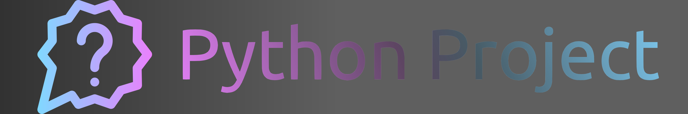
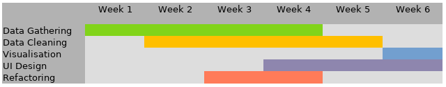

# Python Sample Project

This is a blueprint README.md file for you to use as a guideline on how to format your porject outline.

Here are some more resources on how to format a markdown file for your project repository:
- [GitHub Markdown Guide](https://docs.github.com/en/get-started/writing-on-github/getting-started-with-writing-and-formatting-on-github/basic-writing-and-formatting-syntax)
- [QuickRef Markdown Cheatsheet](https://quickref.me/markdown)
- [DevHints Markdown Cheatsheet](https://devhints.io/markdown)

One example of a previous project repository can be found [here](https://gitlab.gwdg.de/alrun.naake/caterpillar). Please note that some details of the repository and project structure have changed in the meantime, however, this might give you a rough idea on how to structure your work.
----
## Description

For your project, you should mention here

- what your project is
- why you chose this project and goal, and
- how you plan to achieve it.

In the section on how you aim to achive your goal(s), you may want to include sub-sections for each of the main features your project is comprised of.
However, keep this part rather short, and preferably move details into the __functionalities__ section.

----
## Functionalities

Add your plans (with external libraries if you plan on using any) for any of these subsections, if applicable to your project.
As mentioned in the **outline document**, at least 60% of these have to be implemented.

### Data Sources and Retrieval

Will your data be sourced
- From an open dataset (eg. kaggle, data paper,...)
- Collected from an API or a Webcrawler
- From your own research

Reference your data source(s) as well as any tools you will use to collect it, such as API libraries, conversion tools etc.

### Data Storage and Handling

Will you be using a database system (eg. SQL, MongoDB,...)?
How will you load and process data, and what libraries do you plan to use for this (eg. pandas/polars, numpy,...)?

### User Management

Will your project have distinct users?
If so, how do you store and check credentials?
Are there different roles (eg. customer/admin) with privileges?

### Interface

What kind of interface are you planning (CLI/GUI)?
What operating system will it run on, or will it be a web-based app?
What libraries do you need for this?

### Statistical Analysis

What statistical analyses will you conduct on your data?
Will specialized libraries be required for this, and if so, which?
What quintessential point(s)/takeaways are you planning to substantiate?

### Visualizations

How can you effectively communicate your takeaways (probably from statistical analysis) visually?
I.e., what kinds of visual representations are suitable for your project?
Will they be included in a dashboard-like part of your interface, or non-interactive infographics?
With what libraries will you implement this?

### Other (Specify if applicable):
Did you come up with a creative idea to include other functionalities not covered by those above? 
Explain what you did, why this is useful for your project and how you achieved it.
This point has to be agreed on in advance with you tutor.

----
### Table for self-check

Please make sure to include and fill out one of the following tables according to the project type you chose. This is for monitoring your progress and to ease the evalutation by the tutors. Please note that this table is for guidance only, and in case of any discrepancies, the project description document shall take precedence.

#### Default Project

| Category                     | Details                                                                           | Mark with ✔️ |
|:-----------------------------|:----------------------------------------------------------------------------------|--------------|
| 1. Input Data                | Read data from text file “chartIn.txt”                                            |     ...      |
| 2. Login/Logout              | Login via an interface (e.g., web, local)                                         |              |
|                              | Four user accounts userID, name, user_name, and password, one admin               |              |
|                              | No plaintext passwords                                                            |              |
|                              | Logout with timeout and thank you message                                         |              |
| 3. Display Seats             | Display the seat chart with letters and symbols                                   |              |
|                              | Mark occupied seats                                                               |              |
|                              | Logout with timeout                                                               |              |
| 4. Reserve/Cancel Seats      | Users can reserve available seats                                                 |              |
|                              | The admin can cancel reservations                                                 |              |
| 5. Statistics                | The system offers a statistics area for admin users                               |              |
|                              | Statistics can be saved into a text file                                          |              |
| Always mandatory             | Project proposal with incorporated feedback from tutor                            |              |
|                              | GitHub repo with sensible commit messages, template README, contributions section |              |
|                              | Frequent commenting                                                               |              |
|                              | Docstrings for every function/class                                               |              |
|                              | Testing of relevant functionalities to avoid crashing                             |              |
|                              | Help page for system                                                              |              |
|                              | Milestone presentation                                                            |              |
|                              | AI-Usage Cards                                                                    |              |

#### Custom Project

Remember that for the custom project, 4 out of the 7 categories need fulfillment.

| Category                     | Details                                                                           | Mark with ✔️ |
|:-----------------------------|:----------------------------------------------------------------------------------|--------------|
| 1. Source                    | High-quality dataset                                                              |     ...      |
|                              | Quality control / cleaning                                                        |              |
| 2. Data Storage and Handling | Management system                                                                 |              |
|                              | No plaintext passwords                                                            |              |
| 3. User Management           | Login with username, pw                                                           |              |
|                              | Four user accounts userID, name, user_name, and password, one admin               |              |
|                              | Logout with timeout                                                               |              |
| 4. Interface                 | CLI, GUI or Web interface for users                                               |              |
|                              | Extensive interface functions (account management, queries, analysis, help)       |              |
| 5. Statistical Analysis      | Interactive statistics area                                                       |              |
|                              | Basic statistics                                                                  |              |
| 6. Visualisations            | Visualizations displayed or saved                                                 |              |
| 7. Other                     | All aspects that we agreed on with the tutor                                      |              |
| Always mandatory             | Project proposal with incorporated feedback from tutor                            |              |
|                              | GitHub repo with sensible commit messages, template README, contributions section |              |
|                              | Frequent commenting                                                               |              |
|                              | Docstrings for every function/class                                               |              |
|                              | Testing of relevant functionalities to avoid crashing                             |              |
|                              | Help page for system                                                              |              |
|                              | Milestone presentation                                                            |              |
|                              | AI-Usage Cards                                                                    |              |

----
## Installation and Usage

This should inform anyone who looks at your project repository on how they can install and run the project code on their own machine, e.g. by cloning this repository, installing dependencies and running some main script.

----
## Timeline

Give some outline as to what should be achieved at what time during project development.
You could also create a visual guide, such as this

to make sure all relevant aspects of developing an application are accounted for with sufficient time, and in sensible order.
This can also help you and the tutors to make sure the development does not go off the rails, and thus ensure a finished project at the deadline.

----
## Group Details

Here, you should provide a group name you want to be referred to as, as well as the names (and optionally contact info) of all group members.
Additionally, define a group leader, i.e. one person in your group that is the primary contact if tutors want to communicate with your group.
Also mention here which tutor is assigned to your project.

Example:
- Group name: 
- Group code: 
- Group repository: 
- Tutor responsible:  
- Group team leader: 
- Group members:

Include also the (detailed) contribution of each group member to the development of the project.

Example:
**Member A**: Developed the data structure of the project. Helped _Member B_ on the web interface and user management. Refactoring on components X, Y, and Z. Responsible for the unit tests in P and T.

----
## Acknowlegdments

Here, you can (and should) mention all libraries you used, data sources, as well as other credits such as inspirations for your projects, papers that helped with your methodology or similar things.

If you want, you can create subsections for all of these, or just create bullet-points for it. If possible, provide a link to the original source(s).
